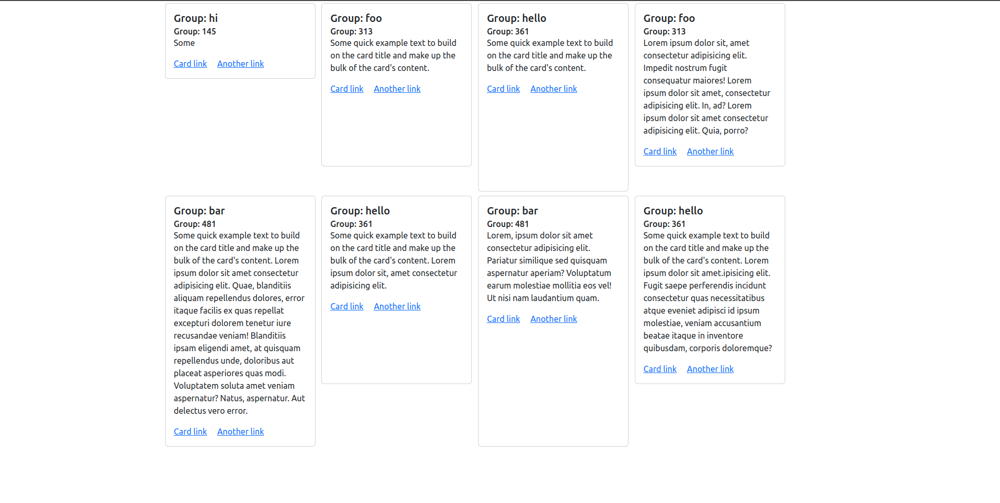

# Auto Height Equalizer

> **Author:** Hart Pableo  
> **Tech:** JavaScript 
> ---   
> *This project is open-source. Do use it if you think it can help you!*

## About the project

This is a very small JS library that aims to deal with equalizing the heights of specific elements on your web page by just using a custom data attribute: `data-equal-height`.

Elements with the same values of this attribute will be considered as one group and the element in this group with the largest `offsetHeight` value will have that height value assigned to all the other elements of the same group as well.

## Contact the Author

Hi there! I am Hart Pableo, a full-stack developer who is passionate in back-end development and building useful systems, platforms, or applications.

You can contact me via email: pableoh@gmail.com